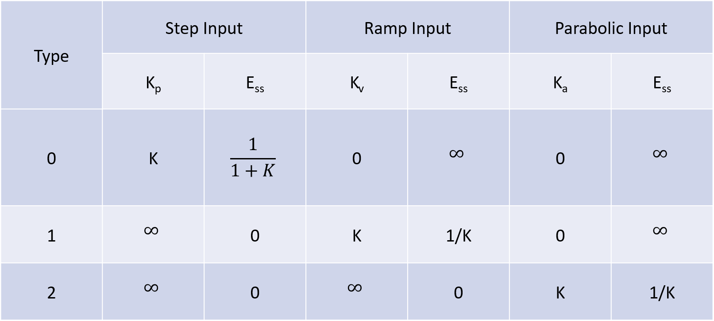

<strong>Theory:</strong> A real time system can be expressed by its transfer function. Based on presence of poles at origin of s plane , transfer functions can be classified as Type ‘0’, Type ‘1’, Type ‘2’ ….. Systems. Let open loop transfer function a system is expressed as: 
$${G(s)H(s) = \frac{k*(1+sT_a )(2+sT_b )... ... ...}{s^N(1+sT_1 )(1+sT_2 )... ... ...}	......(i) }$$

From equation (i) it is clear that ‘N’ determines the number of poles at origin.
  &emsp; For a Type '0' system, N = 0
  &emsp; For a Type '1' system, N = 1
  &emsp; For a Type '2' system, N = 2
  &emsp; &emsp; .
  &emsp; &emsp; .
  &emsp; &emsp; .
  &emsp; &emsp; .
  &emsp; For a Type 'N' system, N = N

 

The steady state error can be found out by the following equation

$${e_ss = \frac{sR(s)}{1+G(s)H(s)}}$$

